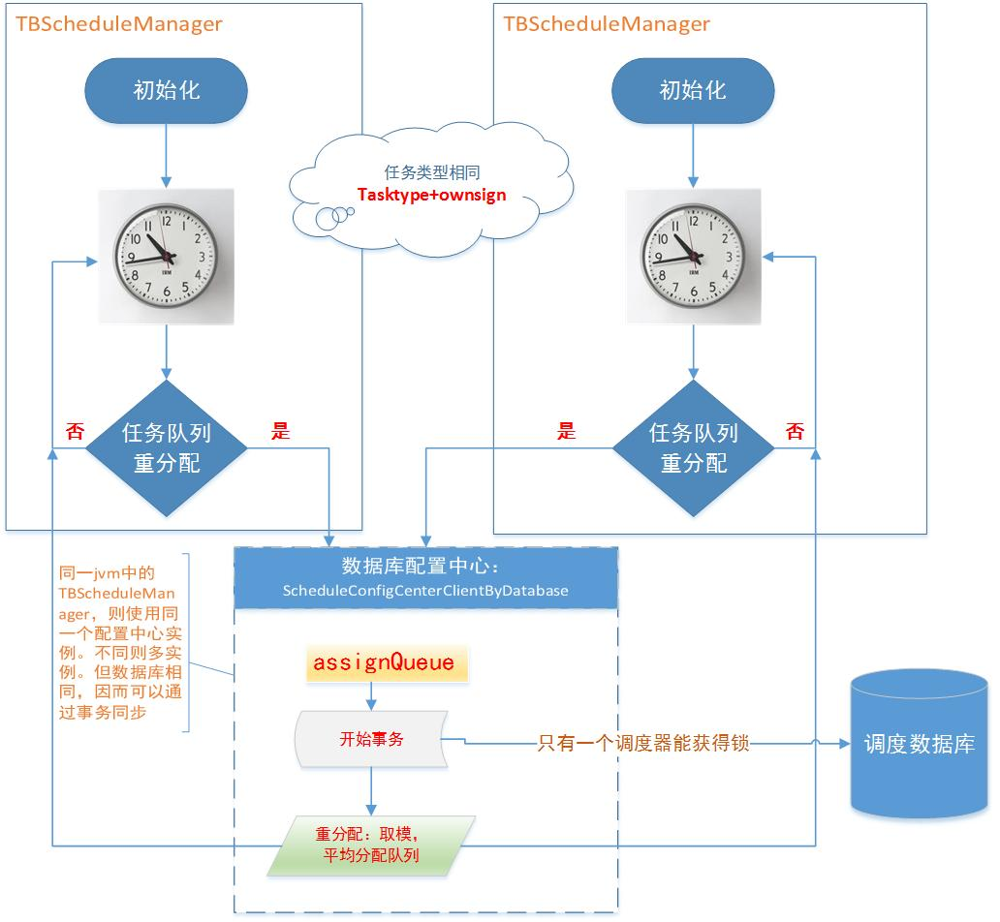

# tbJsp
tbschedule jsp starter

说明：src/package-info.java

## TBScheduleManager注释
/**
 * 1、任务调度分配器的目标：	让所有的任务不重复，不遗漏的被快速处理。
 * 2、一个Manager只管理一种任务类型的一组工作线程。
 * 3、在一个JVM里面可能存在多个处理相同任务类型的Manager，也可能存在处理不同任务类型的Manager。
 * 4、在不同的JVM里面可以存在处理相同任务的Manager 
 * 5、调度的Manager可以动态的随意增加和停止
 * 
 * 主要的职责：
 * 1、定时向集中的数据配置中心更新当前调度服务器的心跳状态
 * 2、向数据配置中心获取所有服务器的状态来重新计算任务的分配。这么做的目标是避免集中任务调度中心的单点问题。
 * 3、在每个批次数据处理完毕后，检查是否有其它处理服务器申请自己把持的任务队列，如果有，则释放给相关处理服务器。
 *  
 * 其它：
 * 	 如果当前服务器在处理当前任务的时候超时，需要清除当前队列，并释放已经把持的任务。并向控制主动中心报警。
 * 
 * @author xuannan
 *
 */

## 在一个JVM里面可能存在多个处理相同任务类型的Manager，也可能存在处理不同任务类型的Manager
 doc文件夹下：数据边界.png
 
## 对某一特定任务类型(taskType + ownsign)，是如何在多个调度服务器(任务类型相同)间分配任务
doc文件夹下：重分配任务.jpg
 
 
1) 核心类及其功能

		调度服务器：TBScheduleManager
		数据库配管中心：ScheduleConfigCenterClientByDatabase

		同一任务类型的TBScheduleManager 都使用同一个ScheduleConfigCenterClientByDatabase

		实际的任务分配是由ScheduleConfigCenterClientByDatabase执行
		
2) 重分配任务的触发

		TBScheduleManager在初始化的时候会启动一个心跳Timer，一般间隔是5秒;
		因此timer会周期性的检测是否需要重新分配任务队列

3) 每个TBScheduleManager都触发重分配，如何解决同步即分配冲突问题？
	
		实质上任务分配由ScheduleConfigCenterClientByDatabase执行，每次分配时，会启动一个事物，就解决了同步问题
		conn = this.getConnection();
		clientInner.assignQueue(conn, taskType,currentUuid,serverList);
		conn.commit();
		
4) 任务队列是如何分配给调度服务器的？

		类似取模的方式，队列平均分配给不同调度服务器

5) 上述分配完成后，PAMIRS_SCHEDULE_QUEUE

		CUR_SERVER	REQ_SERVER
		me			other
		me			null
		me 			null
		other 		null
		...			...
		...			...
		
		分配完毕后，并不代表调度服务就能得到实际队列，还要原来的队列拥有者自行释放给请求者。这些检测，是在心跳周期内完成的
		比如，第一行的me将会在下一个心跳时把队列让渡给other。
		
		每个队列只释放自己拥有，且被别人申请的队列。因此完全的队列重分配不能一蹴而就。
		
		releaseDealQueue
        
## 为何在pamirs_schedule_queue必须对相应tasktype加入对应的base数量队列
为何必须有"Base" ownsign，在pamirs_schedule_queue中有了"Base" ownsign的队列定义后。用户使用其它的
	ownsign时(taskType 相同)。其队列id和数量便可以从base域克隆。base队列数量，决定了系统调度服务器的数量和处理能力，
	这个数据必须由用户定义。
    
## 线程数量和消费的关系
假定IScheduleTaskDealSingle，那么即便用户设置EXECUTE_NUMBER大于1，也会被重置为1
```
TBScheduleManagerFactory.createTBScheduleManager
		TBScheduleManager.TBScheduleManager()
			new Thread.run()
				TBScheduleManager.computerStart()
					TBScheduleManager.resume("开启服务立即启动")
						this.processor = new TBScheduleProcessorNotSleep(this,queueDealTask,this.statisticsInfo);
							for (int i = 0; i < taskTypeInfo.getThreadNumber(); i++) {
								TBScheduleProcessorNotSleep.startThread(i);
									TBScheduleProcessorNotSleep.run()
										executeTask = this.getScheduleTaskId();
												executeTask = this.taskList.remove(0)
										if (executeTask == null ) {
											this.loadScheduleData();
												this.taskList.
													addAll(this.taskDealProcessor.selectTasks(getOwnSign(), getTaskQueueNumber(), taskQueues, getFetchDataNumber()))
											continue;
										}
										((IScheduleTaskDealSingle<Object>) this.taskDealProcessor).execute(executeTask,scheduleManager.getTaskTypeRunningInfo().getOwnSign())
							}
```
## 如何保证不重复，不遗漏
不重复

	sql = "select ID from SCHEDULE_TEST where OWN_SIGN = '" + ownSign + "'  and mod(id," + queueNum+ ") in (" + condition.toString() +") and sts ='N' LIMIT " + fetchNum;

	数据库取任务不重复（确保多个同类型调度服务器不重复执行任务数据）：	
		1）首先任务队列分配采取事务，一定不会重复
		2）查询取任务队列时候，根据队列id取模
		
	特定调度服务器多线程执行不重复：
		1）多线程取数据同步加锁：taskList
			取出元素后增加判断：maybeRepeatTaskList （某个线程加载数据时，其它线程正在执行的任务数据，因为此时尚未回执数据库状态，从数据库查询可能重复）
			
		2）如果有线程还在执行数据，而此时taskList已经为空，此时某个空线程取数据为空则会去数据库加载数据
			将runningTaskList数据拷贝入maybeRepeatTaskList
		
		3）开始执行前，将元素放入runningTaskList，执行完任务finally删除释放

不遗漏

	1）从不重复可以看出，数据加载进来是一定会被执行的
	2）执行失败，或者调度服务故障，则因为没有状态回执，还会被其它调度服务器执行的

共通部分
```
public interface IScheduleProcessor {
	 /**
	  * 是否已经处理完内存中所有的数据，在进行队列切换的时候，
	  * 必须保证所有内存的数据处理完毕
	  * @return
	  */
	 public boolean isDealFinishAllData();

	 /**
	  * 清除所有已经取到内存中的数据，在心跳线程失败的时候调用，避免数据重复
	  */
	 public void clearAllHasFetchData();
}
```

## 每张表的作用是什么？

pamirs_schedule_tasktrun
    
		此表数据是运行过的所有的task_type的数据，和pamirs_schedule_tasktype表数据区别是，
		pamirs_schedule_tasktype表配置的任务，有可能在spring.xml没有配置，所以不被执行，
		这种数据在pamirs_schedule_tasktrun表中是没有的。节点启动时，插入一次数据
		
pamirs_schedule_server

		心跳

## jmx console
jsp management console:
```
	<import resource="kunlun-mbean-config.xml"/>

	http://localhost:5168
```
## 管理console
```
    http://localhost:8080/serverList.jsp
	
	http://localhost:8080/taskTypeInfo.jsp?baseTaskType=PamirsScheduleTest
	
	http://localhost:8080/taskTypeList.jsp
	
	http://localhost:8080/serverHistoryList.jsp
	
	
	http://localhost:8080/createTaskType.jsp?action=createTaskType&taskType=tasktype1&dealBean=hello&queueIds=1,2,3
	http://localhost:8080/createTaskType.jsp?action=clearTaskType&taskType=tasktype1
	http://localhost:8080/createTaskType.jsp?action=deleteTaskType&taskType=tasktype1
```

## 初始化pamirs_schedule_queue
```
insert into PAMIRS_SCHEDULE_QUEUE (ID, TASK_TYPE, QUEUE_ID, OWN_SIGN, GMT_CREATE, GMT_MODIFIED)values (1,'PamirsScheduleTest', '0','BASE',now(),now());
insert into PAMIRS_SCHEDULE_QUEUE (ID, TASK_TYPE, QUEUE_ID, OWN_SIGN, GMT_CREATE, GMT_MODIFIED)values (2,'PamirsScheduleTest', '1','BASE',now(),now());
insert into PAMIRS_SCHEDULE_QUEUE (ID, TASK_TYPE, QUEUE_ID, OWN_SIGN, GMT_CREATE, GMT_MODIFIED)values (3,'PamirsScheduleTest', '2','BASE',now(),now());
insert into PAMIRS_SCHEDULE_QUEUE (ID, TASK_TYPE, QUEUE_ID, OWN_SIGN, GMT_CREATE, GMT_MODIFIED)values (4,'PamirsScheduleTest', '3','BASE',now(),now());
insert into PAMIRS_SCHEDULE_QUEUE (ID, TASK_TYPE, QUEUE_ID, OWN_SIGN, GMT_CREATE, GMT_MODIFIED)values (5,'PamirsScheduleTest', '4','BASE',now(),now());
insert into PAMIRS_SCHEDULE_QUEUE (ID, TASK_TYPE, QUEUE_ID, OWN_SIGN, GMT_CREATE, GMT_MODIFIED)values (6,'PamirsScheduleTest', '5','BASE',now(),now());
insert into PAMIRS_SCHEDULE_QUEUE (ID, TASK_TYPE, QUEUE_ID, OWN_SIGN, GMT_CREATE, GMT_MODIFIED)values (7,'PamirsScheduleTest', '6','BASE',now(),now());
insert into PAMIRS_SCHEDULE_QUEUE (ID, TASK_TYPE, QUEUE_ID, OWN_SIGN, GMT_CREATE, GMT_MODIFIED)values (8,'PamirsScheduleTest', '7','BASE',now(),now());
insert into PAMIRS_SCHEDULE_QUEUE (ID, TASK_TYPE, QUEUE_ID, OWN_SIGN, GMT_CREATE, GMT_MODIFIED)values (9,'PamirsScheduleTest', '8','BASE',now(),now());
insert into PAMIRS_SCHEDULE_QUEUE (ID, TASK_TYPE, QUEUE_ID, OWN_SIGN, GMT_CREATE, GMT_MODIFIED)values (10,'PamirsScheduleTest', '9','BASE',now(),now());

实际上也可以不一定写base
insert into PAMIRS_SCHEDULE_QUEUE (ID, TASK_TYPE, QUEUE_ID, OWN_SIGN, GMT_CREATE, GMT_MODIFIED)values (1,'PamirsScheduleTest', '11','ABC',now(),now());
或者干脆所以11个队列OWN_SIGN都配'ABC'也可以
这样实际的任务队列会配置11个，但是并不规范，所以不建议这么玩

详见ScheduleConfigCenterClientInner.loadAllQueue，没有限制OWN_SIGN必须为'BASE'
```